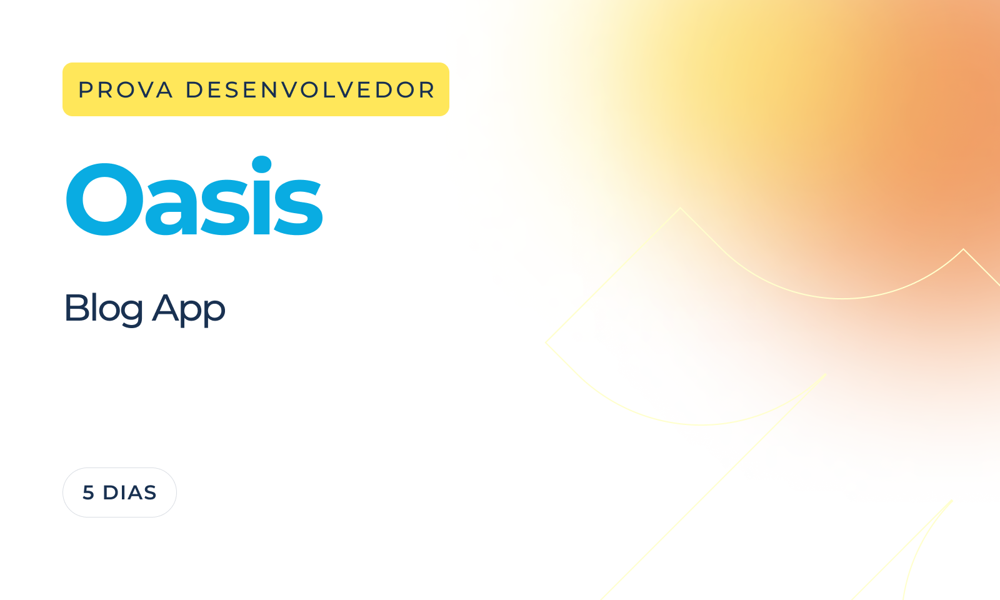

# Oasis Blog

<div align="center" style="display: inline_block">
  
</div>

## Deploy & Design 
###### Em manutenção (parte do que está hospedado está funcional, mas em desenvolvimento está completo).
**Deploy:** [Link para o Deploy](https://oasis-blog-chi.vercel.app/)

## Descrição do Projeto
Este projeto é uma aplicação web de blog desenvolvida com Next.js 14 e TailwindCSS, seguindo um design detalhado fornecido no Figma. A plataforma foi projetada para oferecer uma experiência de leitura agradável, com funcionalidades modernas e otimizações de performance, tornando-a uma solução ideal para a publicação de artigos e navegação por categorias.

Optei por usar MDX para a criar os posts localmente e assim disponibilizar sem precisar de uma requisição a um banco de dados.

#### MDX
MDX (Markdown + JSX) é uma extensão do Markdown que permite incorporar componentes React diretamente dentro do conteúdo. Ele combina a simplicidade do Markdown, amplamente usado para formatação de texto, com o poder e a flexibilidade do React, permitindo criar conteúdos ricos e interativos.

## Funcionalidades Principais

•	Navegação entre Categorias: Permita que os usuários explorem posts agrupados por categorias.

•	Leitura de Artigos: Acesse páginas completas de artigos com conteúdo otimizado.

•	Otimização para SEO: Melhorei a visibilidade nos motores de busca com estratégias modernas.

•	SSR (Server-Side Rendering): Garanti carregamento rápido e conteúdo pré-renderizado.

•	Server Components: Utilizei os benefícios dos novos Server Components para reduzir o impacto no cliente.

•	Comentários com Github Issues

## Tecnologias Utilizadas

<div align="center" style="display: inline_block"><br>
  
  
  
  
  
</div>

•	**Next.js**: Framework React para SSR (Server-Side Rendering), SSG (Static Site Generation) e Server Components.

•	**TypeScript**: Tipagem estática para maior confiabilidade e escalabilidade do código.

•	**TailwindCSS**: Framework de estilização para designs rápidos e responsivos.

•	**Context API**: Gerenciamento de estado simples e eficiente para componentes React.
	
•	**MDX do Next.js**: Criação de posts com Markdown e componentes React embutidos.
	
•	**OpenStreetMap**: Integração com mapas para exibir localizações interativas.
	
•	**Utterances**: Sistema de comentários integrado ao GitHub Issues, simples e eficiente.
	
•	**Resend**: Serviço de envio de e-mails para formulários de contato ou notificações.

•	**Vercel**: Hospedagem na nuvem com otimizações automáticas para performance e SEO.


## Como Executar o Projeto

1. Clone o repositório para sua máquina local:
   ```
   git clone https://github.com/ClemilsonAzevedo/oasis-blog.git
   ```

2. Navegue até o diretório do projeto:
   ```
   cd oasis-blog
   ```

3. Instale as dependências:
   ```
   pnpm install
   ```

4. Inicie o servidor de desenvolvimento:
   ```
   pnpm dev
   ```

5. Acesse a aplicação no navegador:
   ```
   http://localhost:3000
   ```

## Autor

Esta versão do Oasis Blog foi desenvolvido por [Clemilson Azevedo](https://github.com/ClemilsonAzevedo).

